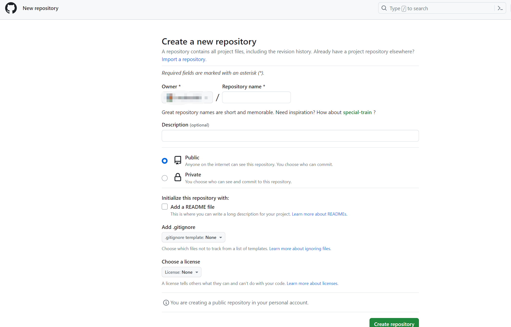
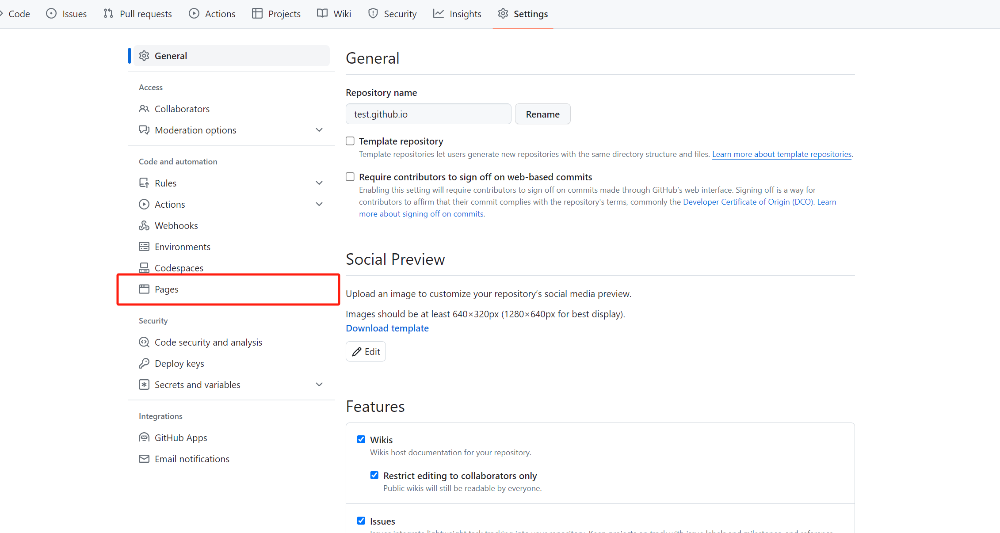
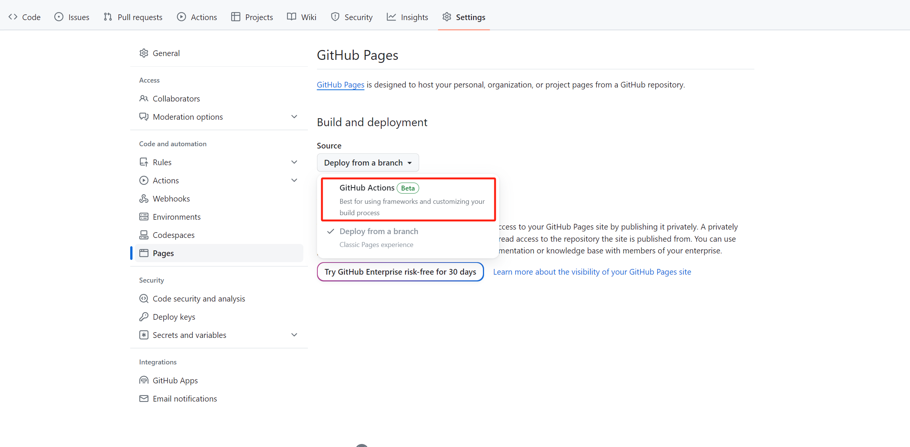

# VitePress + GitHub Pages

> [VitePress官网](https://vitepress.dev/)  
> [GitHub官网](https://GitHub.com/)

## VitePress安装

* 安装
   `VitePress`

    ```shell
    npm add -D VitePress
    ```

    `VitePress附带了一个命令行设置向导，可以帮助您构建基本项目。安装后，通过运行以下命令启动向导`

    ```shell
    npx VitePress init
    ```

    `会被问到几个简单的问题`

    ```shell
    ┌  Welcome to VitePress!
    │
    ◇  Where should VitePress initialize the config?
    │  ./docs
    │
    ◇  Site title:
    │  My Awesome Project
    │
    ◇  Site description:
    │  A VitePress Site
    │
    ◆  Theme:
    │  ● Default Theme (Out of the box, good-looking docs)
    │  ○ Default Theme + Customization
    │  ○ Custom Theme
    └
    ```

* 文件结构
   `假设选择在./docs中构建VitePress项目，生成的文件结构应该如下所示`

    ```shell
    .
    ├─ docs
    │  ├─ .VitePress
    │  │  └─ config.js
    │  ├─ api-examples.md
    │  ├─ markdown-examples.md
    │  └─ index.md
    └─ package.json
    ```

* 配置文件
   `配置文件（.VitePress/config.js）允许自定义VitePress网站的各个方面，最基本的选项是网站的标题和描述`

    ```shell
    // .VitePress/config.js
    export default {
        // site-level options
        title: 'VitePress',
        description: 'Just playing around.',

        themeConfig: {
            // theme-level options
        }
    }
    ```

* 启动和运行
  `package.json`

    ```shell
    {
        ...
        "scripts": {
            "docs:dev": "VitePress dev docs",
            "docs:build": "VitePress build docs",
            "docs:preview": "VitePress preview docs"
        },
        ...
    }
    ```

    `docs:dev脚本将启动一个本地开发服务器，并提供即时热更新。使用以下命令运行它：`

    ```shell
    npm run docs:dev
    ```

    `除了npm脚本，还可以直接调用VitePress：`

    ```shell
    npx VitePress dev docs
    ```

## GitHub Pages

1. 创建 deploy.yml GitHub 工作流文件

   这部分参考的是[这篇文章](https://notes.tangjiayan.cn/web-build/vitepress/vitepress-github-pages.html);

   `在本地的 VitePress 站点文件夹 .github/workflows 下建立 名为 deploy.yml 的文件，内容如下`

   ```yml
    # Sample workflow for building and deploying a VitePress site to GitHub Pages
    #
    name: Deploy VitePress site to Pages

    on:
    # Runs on pushes targeting the `main` branch. Change this to `master` if you're
    # using the `master` branch as the default branch.
    push:
        branches: [main]

    # Allows you to run this workflow manually from the Actions tab
    workflow_dispatch:

    # Sets permissions of the GITHUB_TOKEN to allow deployment to GitHub Pages
    permissions:
    contents: read
    pages: write
    id-token: write

    # Allow only one concurrent deployment, skipping runs queued between the run in-progress and latest queued.
    # However, do NOT cancel in-progress runs as we want to allow these production deployments to complete.
    concurrency:
    group: pages
    cancel-in-progress: false

    jobs:
    # Build job
    build:
        runs-on: ubuntu-latest
        steps:
        - name: Checkout
            uses: actions/checkout@v3
            with:
            fetch-depth: 0 # Not needed if lastUpdated is not enabled
        # - uses: pnpm/action-setup@v2 # Uncomment this if you're using pnpm
        # - uses: oven-sh/setup-bun@v1 # Uncomment this if you're using Bun
        - name: Setup Node
            uses: actions/setup-node@v3
            with:
            node-version: 18
            cache: npm # or pnpm / yarn
        - name: Setup Pages
            uses: actions/configure-pages@v3
        - name: Install dependencies
            run: npm ci # or pnpm install / yarn install / bun install
        - name: Build with VitePress
            run: |
            npm run docs:build # or pnpm docs:build / yarn docs:build / bun run docs:build
            touch docs/.vitepress/dist/.nojekyll
        - name: Upload artifact
            uses: actions/upload-pages-artifact@v2
            with:
            path: docs/.vitepress/dist

    # Deployment job
    deploy:
        environment:
        name: github-pages
        url: ${{ steps.deployment.outputs.page_url }}
        needs: build
        runs-on: ubuntu-latest
        name: Deploy
        steps:
        - name: Deploy to GitHub Pages
            id: deployment
            uses: actions/deploy-pages@v2
   ```

2. 创建仓库
    `创建一个名为 <username>.github.io 的仓库`

    

3. 在本地的 VitePress 站点文件夹下执行以下命令

    ```shell
    # 初始化git
    git init
    # 暂存全部修改
    git add .
    # 提交修改
    git commit -m 'init'
    # 切换分支
    git branch -M main
    # 关联github仓库
    git remote add origin https://github.com/<username>/<username>.github.io.git
    # 推送到分支上
    git push -u origin main
    ```

4. 进入github仓库的settings 并点击进入Pages页面

   

5. 点击Source选项 选择GitHub Actions

   
