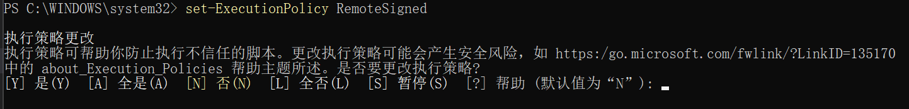

# windows环境，解决VSCode的终端不是管理员权限打开的问题

[原文章链接](https://www.cnblogs.com/keRee/p/16173863.html)

使用管理员权限打开PowerShell 执行命令 `set-ExecutionPolicy RemoteSigned`

在输入框里输入A后回车确认就行了，此时，再次在VSCode中打开终端就会是以管理员权限运行的状态；

这里，命令：get-ExecutionPolicy , 是用来查看当前的设置！
